<h1 style="text-align:center">SoleHaven</h1>

Welcome to SoleHaven. SoleHaven is a fictional online store for consumers to purchase premium shoes. This app provides a wide selection of new shoes for users to browse and pick and choose which ones they want. It also allows users to create reviews on each product.

Live project can be found here: [SolveHaven](https://solehaven-8ecf0af00880.herokuapp.com/)

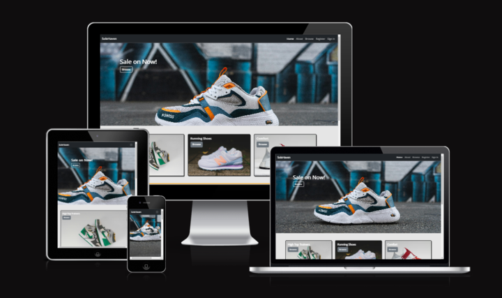

## Index
* [UX Design](#ux-design)
  * [Website Goals](#website-goals)
  * [Planning](#planning)
  * [Epics](#epics)
  * [User Stories](#user-stories)

* [Features](#features)

* [Wireframes](#wireframes)
  * [Home](#home-page)
  * [About](#about-page)
  * [Register](#registersign-up-page)
  * [Sign In](#sign-in-page)
  * [Sign Out](#sign-out-page)

* [Technologies Used](#technologies-used)

* [Testing](#testing)
  * [Validator Testing](#validator-testing)
  * [Manual Testing](#manual-testing)
  * [Lighthouse Testing](#lighthouse-testing)
  * [Bugs](#bugs)

* [Deployment](#deployment)

* [Credits](#credits)
  * [Images](#images)
  * [Videos](#videos)
  * [Code](#code)
  * [Content](#content)

## UX Design

### Website Goals

There is no specific target audience; anyone who has even a slight interest in premium trainers is welcome. The main aim of this website is to allow those users to browse around and pick out which trainers they want. The website is a simple design so it's easy to navigate and find exactly what you're looking for.

This website also aims to allow users to create, edit and delete their own reviews of the product, giving it a rating. Users will be able to see other users reviews and what they think about a specific product. Ratings of each product will also be viewable for users.

### Planning

This website was created using the agile methodology - working and pushing small features incrementally. This project was produced in 10 days so it was important to not space out development time too much. 

Furthermore, the project features were assigned with epics, detailing the reason behind why it was needed, and also assigned labels with MoSCoW(Must Have, Should Have, Could have and Won't Have) prioritisation. "Must Have" were given top prioritisation as they are essential for the projects functionality. "Should Have" labels are second on the list, "Could Have" is third and finally "Won't Have" is last and will be added to the backlog for future iterations. It was done this way to fufil the MVP requirements and minimise the scope of the project to present a functioning website.

Below is the Kanban board which was used throughout the project development cycle and was created using Trello:
[Trello]([LINK HERE])

### Epics

**EPIC 1 - Setup**

The first epic is the setup. The setup is necessary for the application to have a base structure and wouldn't be possible to create a project without this.

**EPIC 2 - Authentication**

This epic is a critical step for the main function of the website and is related to all the user stories related to authentication. This will allow users to create profiles and view the pages that should only be accessible to them. 

**EPIC 3 - Products**

The product epic is for all user stories relating to the products on display. Site owners will be able to create, edit and delete products if necessary so users are given the correct information on display.

**EPIC 4 - Reviews**

This is related to all the user stories that are related to creating, reading, updating and deleting reviews. This allows users to see other users opinions on certain products, as well as, site owners to see what their best rated products are.

**EPIC 5 - Deployment**

This epic is to detail the steps made in deploying the project to Heroku for users to access and use.

### User Stories

**EPIC 1 - Setup**
- As a developer, I want to create a base.html page so I can extend it to the other html pages for reusability.

- As a developer, I want to create static files so that I can store images, CSS and JavaScript code so that it can be linked to the pages and work on the deployed website.

- As a developer, I want to create a header and footer which includes navbar and necessary links so that users have an easy time navigating through the website.

**EPIC 2 - Authentication**
- As a developer, I want to incorporate authentication so that users have the ability to create an account and login/logout.

- As a Site Owner, I want authentication implementation so that users accessing the site can create an account to purchase products and leave reviews.

- As a Site User, I want authentication implemented so I can create a personal account to purchase products and leave reviews for other users.

**EPIC 3 - Products**
- As a Site Owner, I want to be able to create new products to post on the site so that I can ensure any new products after inital deployment can be added.

- As a Site Owner, I want to be able to edit/delete products so that users can only see the available products we have to offer.

- As a user, I want to be able to view any products the site are offering so that I can see if I am interested in them for potential purchase.

**EPIC 4 - Reviews**
- As a Site Owner, I want to see users reviews on products so that we have the necessary data to see why users like or don't like certain products.

- As a Site User, I want to see other user reviews so that I can make a decision on a potential purchase.

- As a Site User, I want to create reviews so that I can express my opinion on certain products.

- As a Site User, I want to edit/delete my own reviews so that in case my opinion has changed, I can reflect that in the review after the inital post.

**EPIC 5 - Deployment**
- As a developer, I want to collect static files so they are served for deployment on Heroku.

- As a developer, I want to deploy the project on Heroku so that it can be accessed by users.

## Features

- **User Authentication**
  - Register an account
  - Log in after account creation
  - Sign out
  - Logged out users cannot post reviews and are prompted to login

- **Navbar**
  - Shows different pages for users to access
  - Indicator to show what page you're on
  - Responsive on smaller screens (burger icon)

- **CRUD Functionality**
  - Logged in users can post reviews
  - Logged in users can edit/delete their reviews

### Future Features
- Basket 
  - Allow users to add products to their personalised basket

- Search
  - Allow users to search for products 

- Categories
  - Allow users to filter products by categories

## Wireframes

### Home Page
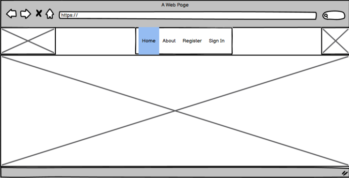
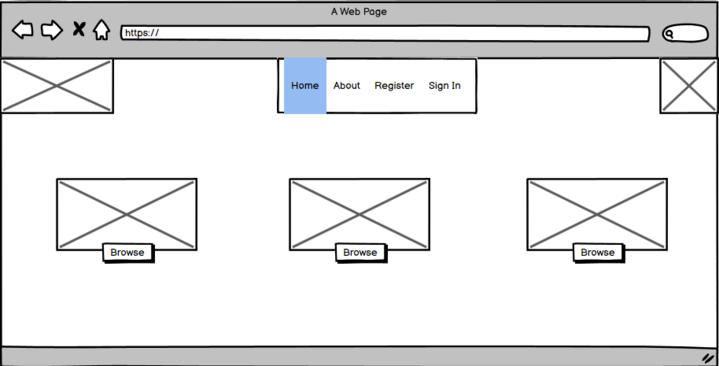
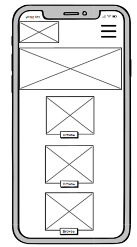

### About Page
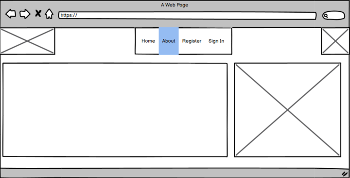
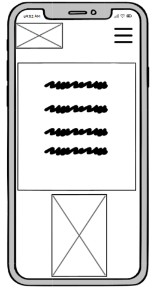

### Register/Sign Up Page
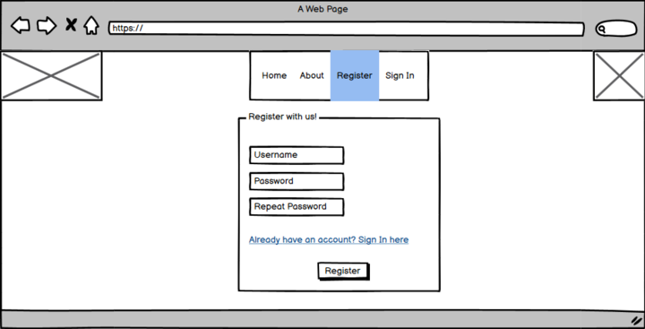
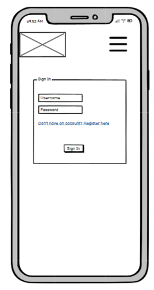

### Sign In Page
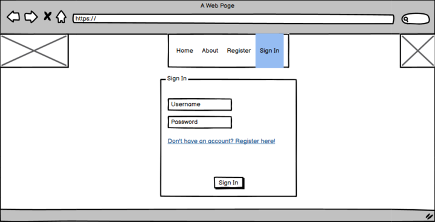

### Sign Out Page
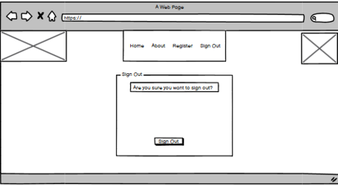
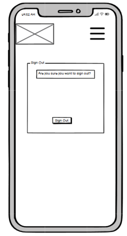

### ERD
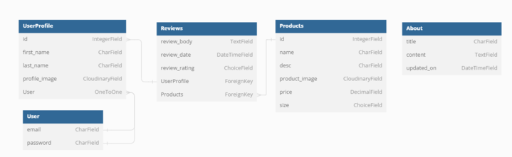

## Technologies Used

- Languages
  - HTML5
  - CSS3
  - JavaScript
  - Python

- Frameworks
  - Bootstrap 4+
  - Django

- Databases & Deployment
  - ElephantSQL
  - Cloudinary - Streamline media management and improve user experience by automatically delivering images and videos, enhanced and optimized for every user.

- Libraries & Programs
  - [GitHub](https://github.com) - Used to create the repository for the project.
  - [Trello](https://trello.com) - Used for the project Kanban Board to monitor the progress of the project.
  - [Gitpod](https://www.gitpod.io/) - Cloud based development environment 
  - [Balsamiq](https://balsamiq.com/) - Wireframing tool for the design process
  - [Google Fonts](https://fonts.google.com/) - Used to import various fonts for the design process
  - [Miro](https://miro.com/) - For brainstorming ideas for any part of the project

## Testing

### Validator Testing
For HTML/CSS Validation testing, my project passed both with no errors shown:

- **HTML**
  - Validator Test for HTML5: [W3C HTML Validation](docs/README_images/HTML_validator.png)

- **CSS**
  - Validator test for CSS3: [W3C CSS Validation](docs/README_images/CSS_validator.png)

### Manual Testing
**Admin**

| Test | Result |
| --- | --- |
| As a Site Admin I can post products on admin panel | Pass |
| As a Site Admin I can edit/delete posts | Pass |

**Logged in users**

| Test | Result |
| --- | --- |
| As a logged in user I can post reviews on product pages | Pass |
| As a logged in user I can edit my own reviews | Pass |
| As a logged in user I can delete my own reviews | Pass |
| As a logged in user I can view all the pages accessible to me | Pass |
| As a logged in user I am prompted if I successfully logged in | Pass |
| As a logged in user I am prompted if I successfully logged out | Pass |

**Logged out users**

| Test | Result |
| --- | --- |
| As a logged out user I cannot post reviews on product pages | Pass |
| As a logged out user I am prompted to login/register to post a review | Pass |
| As a logged out user I can view all the pages accessible to me | Pass |

**Registering an account**

| Test | Result |
| --- | --- |
| As a user I can create an account | Pass |
| As a user I can sign into my account after registration | Pass |
| As a user I can sign out of my account | Pass |

**Navbar**

| Test | Result |
| --- | --- |
| Navbrand link navigates to 'Home' | Pass |
| 'Home' link works on navbar | Pass |
| 'About' link works on navbar | Pass |
| 'Browse' link works on navbar | Pass |
| 'Register' link works on navbar | Pass |
| 'Sign In' link works on navbar | Pass |
| 'Sign Out' link works on navbar | Pass |

**Footer**

| Test | Result |
| --- | --- |
| Social links work and open in new tab | Pass |
| Other general links work and navigate accordingly | Pass |

**Buttons/Links**

| Test | Result |
| --- | --- |
| Buttons on 'Home' page works and are linked proeprly | Pass |
| Buttons on 'Browse' page works and are linked proeprly | Pass |
| Product detail page on 'Browse' page works and are linked proeprly | Pass |

### Lighthouse Testing
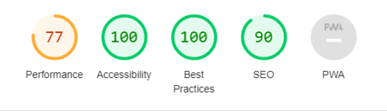

### PEP8 Testing

### Bugs
- Small description

## Deployment

This project was deployed via [Heroku](https://www.heroku.com). It's a platform as a service (PaaS) that enables developers to build, run, and operate applications entirely in the cloud.

Your development environment needs specific files to deploy successfully on Heroku:

**Settings**
- Ensure your 'DEBUG' value in your settings.py is set to False before deploying.

**Required files before deployment**
- requirements.txt 
  - This file is necessary as it identifies all your installed packages
  - For Heroku deployment, install gunicorn with the following command: `pip3 install gunicorn~=20.1.0`
  - After ensure to add it in your requirements.txt file with the following command: `pip3 freeze --local > requirements.txt`

- Procfile
  - This is so Heroku can identify what kind of service you are running. 
  - As it's a web based app, you must put the following in: `web: gunicorn **project_name**.wsgi `

**Steps for deployment**
1. On your dashboard, select 'New' near the top right. You will be provided with two options in the drop down; select 'Create a new app'.

2. Next step, you will give your app a name (has to be unique). After, select your region, in my case it was Europe. Finally, click on 'Create App'.

3. Once the app has successfully been created, navigate to the 'Settings' tab and select 'Reveal Config Vars' and input your variables

| Key | Value |
| --- | --- |
| `CLOUDINARY_URL` | [Enter your cloudinary URL] |
| `DATABASE_URL` | [Enter your database URL (ElephantSQL)] |
| `DISABLE_COLLECTSTATIC` | 1 (This is only temporary, once you collectstatic you will need to remove it) |
| `SECRET_KEY` | [Enter your secret key (Find secure ones by using a generator)] |

4. Once your convig vars are put in correctly, switch over to the 'Deploy' tab and select your deployment method (GitHub) then connect your account.

5. After your account has connected successfully, scroll down to 'Manual deploy' and choose the branch (Main). 

6. Click on 'Deploy Branch' and wait for Heroku to deploy the project.

7. Finally, after Heroku successfully deploys the project, scroll to the top of the page and there will be a button located near the top right called 'Open app'. This will open your app on a new page and you can view your newly deployed project. 

**Note**
- As it's a manual deployment, you will need to redeploy your app everytime you make changes to it.

## Credits

### Images
- Open Source images used in the project:
  - [unsplash](https://unsplash.com/)

- Favicon
  - [Favivon.io](https://favicon.io/favicon-generator/)

### Videos
- Freecodecamp.org
  - [freecodecamp](https://www.youtube.com/@freecodecamp)

### Code
- Code Institute 
  - For general Django setup refresher and terminal commands.

- Stack Overflow
  - For bug fixes and best practices.

### Content
- Used ChatGPT v3.5:
  - Some of the 'About' page text.
  - Testimonial section on 'Home' page.
  - General bug fixing and code clean up.